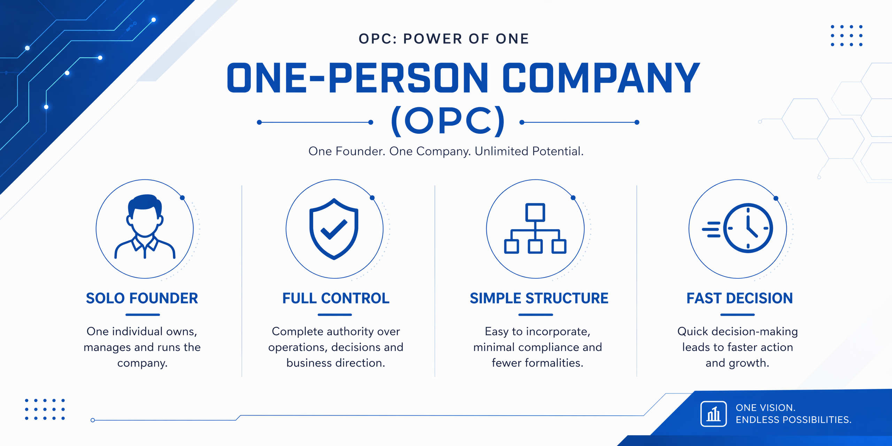

# Awesome OPC 

🌐 A curated list of awesome resources for **OPC (One Person Companies)** — policies, inspiration, projects, tools, and more.

Help solo founders find direction, build faster, and thrive independently.

[Introduction](#introduction) · [OPC Starter](#-opc-starter) · [Policies](#-policies) · [Inspiration](#-inspiration) · [Tools](#-tools) · [Resources](#-resources)

---

## Contents

- [Introduction](#introduction)
- [What is OPC?](#what-is-opc)
- [Selection Criteria](#selection-criteria)
- [🎯 OPC Starter](#-opc-starter)
- [🏛 Policies](#-policies)
  - [China](#china)
  - [United States](#united-states)
  - [Europe](#europe)
  - [Others](#others)
- [💡 Inspiration](#-inspiration)
  - [Success Stories](#success-stories)
  - [Notable OPC Products](#notable-opc-products)
  - [Interviews & Talks](#interviews--talks)
- [🛠 Tools](#-tools)
  - [Building & Development](#building--development)
  - [Design & UI](#design--ui)
  - [Marketing & Growth](#marketing--growth)
  - [Finance & Accounting](#finance--accounting)
  - [Productivity & Operations](#productivity--operations)
  - [AI-Powered](#ai-powered)
  - [AI Agents](#ai-agents)
  - [Video & Audio](#video--audio)
  - [SEO & GEO](#seo--geo)
  - [Customer Support](#customer-support)
  - [Sales & Outbound](#sales--outbound)
- [📚 Resources](#-resources)
  - [Books](#books)
  - [Newsletters](#newsletters)
  - [Podcasts](#podcasts)
  - [Communities](#communities)
  - [Courses](#courses)
  - [Reports](#reports)
- [Contributing](#contributing)
- [License](#license)

---

## Introduction

> One person, one company, infinite possibilities.

This project curates everything a solo founder needs — from understanding policies and regulations, to finding inspiration from those who've walked the path, to discovering the best tools and resources that make running a one-person company not just possible, but powerful.

## What is OPC

**OPC (One Person Company)** is a business structure where a single individual operates as both the sole shareholder and director. With the rise of AI, no-code tools, and the creator economy, running a profitable company solo has never been more achievable.

In this list, OPC is used broadly: it includes formal one-person company structures, solo founder businesses, indie products, and small operations intentionally run by one person.

## Selection Criteria

To keep this list useful and trustworthy:

- Prefer official sources for policies, registration, tax, and legal information.
- Include tools that are broadly useful to solo operators, not just newly launched or promotional products.
- Add case studies only when there is a public source for the founder, product, or reported milestone.
- Mark time-sensitive claims, such as revenue, user count, policy status, or market reports, with a year when possible.
- Keep descriptions concise, factual, and focused on why the resource helps one-person companies.

---

## 🎯 OPC Starter

*Your quick-start checklist for launching a one-person company.*

1. **Find your niche** — Pick a specific problem, validate demand, confirm willingness to pay.
2. **Register your business** — Choose a legal structure (LLC, sole prop, etc.), open a business bank account.
3. **Build your MVP** — Ship the simplest version that delivers value. Use AI tools to move fast.
4. **Set up payments** — Integrate Stripe, Lemon Squeezy, or similar. Track finances from day one.
5. **Launch & get users** — Go where your audience is. Build in public. First 10 users > first 10,000.
6. **Automate & scale solo** — Use AI agents and SaaS to handle support, marketing, ops, and reporting.

⚠️ Key Reminders

- **You are the bottleneck** — Ruthlessly prioritize. Delegate to AI what doesn't need your judgment.
- **Revenue first** — One paying customer is worth more than a thousand stars on GitHub.
- **Automate everything repeatable** — If you're doing it twice a week, automate it. Your time is the scarcest resource.
- **Separate you from the company** — Use limited liability, business bank accounts, and proper contracts from day one.
- **Ship fast, iterate faster** — Solo means no meetings, no approvals. Use that speed as your competitive advantage.
- **Build in public, but protect your moat** — Share your journey to attract users, but keep your unfair advantage close.

---

## 🏛 Policies

*Regulations, legal frameworks, and tax policies related to one-person companies across the globe.*

### China

- [《中华人民共和国公司法》](https://guangdong.chinatax.gov.cn/gdsw/zjfg/2025-12/31/content_1203d9ef77944845aeca8ce79160292d.shtml) — 2023 年修订版公司法，取消一人有限公司数量限制，允许自然人设立多家一人公司。
- [新《公司法》解读 — 上海市人民政府](https://www.shanghai.gov.cn/xbhygq/20240702/fc72a6538b8642e5b2e204ccd291f8ed.html) — 上海市政府对新《公司法》关于一人有限公司等条款的权威解读。
- [杭州市加大个体工商户培育帮扶力度支持转型升级实施意见 — 杭州市人民政府](https://zfgb.hangzhou.gov.cn/15/101220263/t106220263014/530157.shtml) — 杭州市关于个体工商户培育帮扶及支持"个转企"的政策措施。
- [深圳市扶持个体工商户高质量发展若干措施 — 深圳市市场监督管理局](https://amr.sz.gov.cn/xxgk/qt/ztlm/jyztdjzc/flfgjzcjd/content/post_12616867.html) — 深圳市创业担保贷款、减费让利等扶持个体工商户的系列政策。
- [安徽省进一步促进个体工商户发展若干措施解读 — 安徽省人民政府](https://www.ah.gov.cn/content/article/564252431) — 安徽省（含合肥）促进个体工商户发展的政策措施及解读。

### United States

- [Choose a Business Structure — U.S. SBA](https://www.sba.gov/business-guide/launch-your-business/choose-business-structure) — Official guide from the Small Business Administration on sole proprietorship, LLC, and other structures.
- [Register Your Business — U.S. SBA](https://www.sba.gov/business-guide/launch-your-business/register-your-business) — Step-by-step guide to registering your business with state and local governments.
- [Starting a Business — IRS](https://www.irs.gov/businesses/small-businesses-self-employed/starting-a-business) — Federal tax information and requirements for starting a sole proprietorship or LLC.

### Europe

- [Single-Member Private Limited Liability Companies — EUR-Lex](https://eur-lex.europa.eu/EN/legal-content/summary/single-member-private-limited-liability-companies.html) — EU Directive on single-member companies, enabling limitation of liability for individual entrepreneurs.
- [Company Law and Corporate Governance — European Commission](https://commission.europa.eu/topics/business-and-industry/doing-business-eu/company-law-and-corporate-governance_en) — EU's unified corporate legal framework for doing business across the Single Market.

### Others

- [Choosing a Business Structure — ACRA Singapore](https://www.acra.gov.sg/register/business/choosing-business-structure/) — Singapore's official guide on sole proprietorship, partnership, and company structures.
- [Registering a Sole Proprietorship — ACRA Singapore](https://www.acra.gov.sg/register/business/registering-different-business-structures/sole-proprietorship-or-partnership/) — Step-by-step registration guide for solo business owners in Singapore.
- [一人会社の設立登記 — 法務省](https://www.moj.go.jp/MINJI/minji06_00117.html) — Japan's Ministry of Justice guide on online registration for one-person companies.
- ['One Person Company' under the Companies Act, 2013 — SSRN](https://papers.ssrn.com/sol3/papers.cfm?abstract_id=3157951) — Legal background for India's OPC form and its move from minimum-two-person to single-member company formation.
- [One Person Company and Its Role in Promotion of Entrepreneurship in India](https://ijcrt.org/papers/IJCRT22A6066.pdf) — Connects the OPC legal structure to entrepreneurship promotion and limited-liability solo ownership in India.
- [One-Person LLC: Governance of Indonesian Legal Entities for MSEs](https://ejournal.undip.ac.id/index.php/dlr/article/view/44378/0) — Studies governance issues in one-person limited liability companies for micro and small enterprises in Indonesia.

---

## 💡 Inspiration

*Real stories, companies, and talks that prove one person can build something remarkable.*

### Success Stories

- [Pieter Levels — $3M/yr as a Solo Founder](https://levels.io/) — Built Nomad List, Remote OK, and PhotoAI entirely solo, generating millions per year with zero employees.
- [Maor Shlomo — Base44 Sold for $80M](https://medium.com/@ayushojha010/the-next-1-man-million-dollar-startup-why-2025-is-the-year-of-the-solo-founder-d220edd35203) — Solo-built AI startup acquired by Wix for $80M in cash, just six months after launch.
- [AJ — Carrd](https://carrd.co/) — One person built Carrd into a widely-used landing page builder with millions of users and $1M+ ARR.
- [Marc Lou — $1.03M/yr as an Indie Developer](https://shipfa.st/) — Built 25 projects, 12 profitable. Founder of ShipFast, the " Done For You" SaaS boilerplate.
- [Nathan Barry — ConvertKit $29M ARR](https://convertkit.com/) — Built an email marketing platform for creators to 500K+ users and $29M ARR.

### Notable OPC Products

-  [Bannerbear](https://www.bannerbear.com/) — Automated image and video generation API, bootstrapped to $600K ARR by solo founder Jon Yongfook.
-  [Cubox](https://cubox.pro/) — Read-later app built by a solo Chinese founder. AI-powered note-taking and knowledge management.
-  [DesignJoy](https://www.designjoy.co/) — Brett Williams turned productized design into a $200K/month one-person agency with a subscription model.
-  [Nomad List](https://nomadlist.com/) — The go-to platform for digital nomads to find the best cities to live and work remotely.
-  [PhotoAI](https://photoai.com/) — AI photo generator by Pieter Levels, reaching $100K+/month as a solo product.
-  [Photopea](https://www.photopea.com/) — A free browser-based Photoshop alternative built and maintained solo by Ivan Kutskir for 11+ years. Millions of daily users.
-  [Stardew Valley](https://www.stardewvalley.net/) — Eric Barone solo-built this farming RPG over 4.5 years. 50M+ copies sold, $500M+ revenue. One of the most successful indie games ever.
-  [TLDR Newsletter](https://tldr.tech/) — Dan Ni built a daily tech newsletter into a multi-million dollar AI-powered media business, solo.
-  [TypingMind](https://www.typingmind.com/) — Tony Dinh's AI chat interface that reached $45K MRR as a solo product, riding the ChatGPT wave.
-  [小熊猫 C++ IDE](https://github.com/royqh1979/RedPanda-CPP) — Free C/C++ IDE for Windows built and maintained solo. ¥5 万+/月 revenue.

### Interviews & Talks

- [Pieter Levels on Lex Fridman Podcast](https://www.youtube.com/watch?v=oFtjKbXKqbg) — Deep dive into programming, viral AI startups, and the digital nomad life of the most famous solo founder.
- [How to Build a Startup Without Funding — Pieter Levels @ Dojo Bali](https://www.youtube.com/watch?v=6reLWfFNer0) — Practical talk on shipping fast, staying lean, and building profitable products without investors.
- [The One-Person Startup Era Has Officially Begun](https://www.youtube.com/watch?v=rsSUIvAkjvk) — Sam Altman predicted the first one-person billion-dollar company — and the numbers are backing it up.

---

## 🛠 Tools

*The essential toolkit for solo founders — build, ship, and grow by yourself.* 

### Building & Development

-  [Bolt.new](https://bolt.new/) — Full-stack app from a single prompt — frontend, backend, database, and hosting. Free tier includes 1M tokens/month and unlimited databases.
-  [Claude Code](https://claude.com/claude-code) — Anthropic's terminal agent for complex engineering. Large refactors, architectural decisions, and debugging. The senior engineer in your terminal. (Product Hunt #1 2024)
-  [Cursor](https://cursor.sh/) — AI-first code editor with deep codebase understanding. Tab prediction goes beyond autocomplete — predicts next cursor position and code diffs. (Product Hunt Product of the Year 2024)
-  [DigitalOcean](https://digitalocean.com/) — Simple cloud computing with $6/month starter VPS, good docs, and developer-friendly APIs.
-  [GitHub Copilot](https://github.com/features/copilot) — Inline code completion that integrates with all major editors. The most widely adopted AI coding tool in the world.
-  [Hetzner](https://hetzner.com/) — Budget-friendly German cloud provider. VPS starting at €4.5/month with excellent price-to-performance.
-  [Lovable](https://lovable.dev/) — Most beginner-friendly full-stack AI app builder. Generates clean React + Supabase apps from natural language prompts.
-  [PlanetScale](https://planetscale.com/) — Serverless MySQL platform with branching, horizontal scaling, and instant schema changes.
-  [Railway](https://railway.app/) — Deploy backends, databases, and cron jobs in seconds. Great DX for solo devs.
-  [Supabase](https://supabase.com/) — Open-source Firebase alternative — the default backend for solo SaaS. Postgres, auth, storage, real-time, and edge functions in one. (Product Hunt DEV TOOL WINNER)
-  [Turso](https://turso.tech/) — Edge-hosted SQLite database. LibSQL implementation with excellent DX and replication options.
-  [Upstash](https://upstash.com/) — Serverless Redis and Kafka. Pay-per-request with global replication, perfect for serverless workloads.
-  [v0](https://v0.dev/) — AI UI component generator by Vercel. Produces production-quality React/Next.js code with shadcn/ui and Tailwind.
-  [Vercel](https://vercel.com/) — Zero-config deployment platform for frontend and full-stack apps. Git push → production.
-  [WeaveFox](https://www.weavefox.cn/) — Free AIGC platform that turns text prompts into full-stack applications with one-click deployment.
-  [Windsurf](https://codeium.com/windsurf) — AI-first IDE with agentic coding flows for complex multi-file edits. Strong alternative to Cursor with competitive free tier.

### Design & UI

-  [Adobe Firefly](https://firefly.adobe.com/) — Professional image editing and generation within Adobe's ecosystem. Commercial-safe AI imagery trained on licensed content.
-  [Canva AI](https://www.canva.com/) — All-in-one design for non-designers. Marketing graphics, social posts, presentations, videos, and documents with AI assistance.
-  [Figma](https://www.figma.com/) — Industry-standard collaborative design tool with powerful AI features. Essential for app interface design and team collaboration.
-  [Framer](https://www.framer.com/) — Build and publish stunning websites visually, no code required.
-  [Google Stitch](https://stitch.withgoogle.com/) — AI-powered UI design tool by Google that generates mobile and web UIs from text or image prompts.
-  [Lovart](https://www.lovart.ai/) — World's first AI Design Agent. Collaborative canvas for branding and marketing — upload references, sketch concepts, edit layers.
-  [Midjourney](https://www.midjourney.com/) — Industry-leading AI image generation. Unmatched aesthetic quality for product mockups, marketing visuals, illustrations, and brand imagery.
-  [Shadcn/ui](https://ui.shadcn.com/) — Beautiful, copy-paste React components built on Radix UI and Tailwind CSS.

### Marketing & Growth

-  [Beehiiv](https://www.beehiiv.com/) — Newsletter platform built for growth. 0% revenue share, built-in referral system, ad network, and AI website builder. Native MCP integration for Claude.
-  [Buffer](https://buffer.com/) — Social media scheduling and analytics with AI caption suggestions. Manage all platforms from one dashboard.
-  [Plausible](https://plausible.io/) — Privacy-friendly, lightweight web analytics. No cookie banners needed.
-  [PostHog](https://posthog.com/) — Full-featured product analytics. Session recording, feature flags, A/B testing, and self-hosted option. Free tier up to 1M events/month.
-  [Umami](https://umami.is/) — Open-source web analytics. Simple, privacy-focused, and self-hostable for free.
-  [X](https://x.com/) — The go-to platform for building in public and growing an audience as a solo founder.

### Finance & Accounting

-  [Alipay AI Pay](https://aipay.alipay.com/) — AI-native payment solution by Alipay that enables AI agents to handle transactions seamlessly. 100M+ users, ideal for agentic commerce.
-  [支付宝](https://b.alipay.com/) — Alibaba's payment platform. 0.6% fee, required for serving Chinese customers.
-  [Fondo](https://www.fondo.com/) — AI-powered bookkeeping for startups. Automated categorization, monthly closes, tax preparation, and R&D tax credits.
-  [Lemon Squeezy](https://www.lemonsqueezy.com/) — Merchant of record for digital products. Handles global tax, billing, VAT, and compliance — so you don't have to.
-  [LLC Class](https://llcclass.com) — [Wyoming LLC registration](https://llcclass.com/wyoming) for non-US solo founders — includes [registered agent for LLC](https://llcclass.com/what-is-llc-registered-agent), EIN, and Operating Agreement to unlock Stripe and US business banking.
-  [Mercury](https://mercury.com/) — Banking built for startups. Treasury, corporate cards, and financial workflows designed for one-person companies. No fees.
-  [Paddle](https://paddle.com/) — Merchant of record specializing in EU compliance. Handles VAT, tax, and global billing — 5% + $0.50 fee.
-  [微信支付](https://pay.weixin.qq.com/) — China's dominant mobile payment. 0.6% fee, essential for Chinese market.
-  [QuickBooks Solopreneur](https://quickbooks.intuit.com/solopreneur/) — Auto-categorizes expenses, tracks mileage, captures receipts, and estimates quarterly taxes.
-  [Stripe](https://stripe.com/) — The default payment infrastructure for SaaS. Checkout, subscriptions, invoicing, and customer portal. Powers millions of one-person companies.
-  [Xero](https://www.xero.com/) — Cloud-based accounting software designed for small businesses and solo operators.

### Productivity & Operations

-  [Cal.com](https://cal.com/) — Open-source scheduling with booking pages, round-robin, and workflow automation. The Calendly alternative that respects your data.
-  [Carrd](https://carrd.co/) — Ultra-simple one-page sites for solo founders. $9-49/year flat fee, perfect for landing pages and mini-products.
-  [Linear](https://linear.app/) — Fast, streamlined issue tracking and project management for builders who ship.
-  [Make](https://www.make.com/) — Visual workflow automation — the sweet spot between Zapier's ease and n8n's power. See the actual logic, add JS when needed.
-  [n8n](https://n8n.io/) — Open-source workflow automation with unlimited workflows and zero usage fees. Full code access when needed.
-  [Notion AI](https://www.notion.so/product/ai) — All-in-one workspace with AI. Docs, databases, projects, meeting summaries, and knowledge base. The operating system for one-person companies.
-  [Reclaim.ai](https://reclaim.ai/) — AI calendar that defends focus blocks, schedules habits, and finds optimal meeting slots based on your energy patterns.
-  [Super](https://super.so/) — Turn Notion into a website. $12/month for a beautiful, fast site with your Notion content as the CMS.
-  [Zapier](https://zapier.com/) — Connect 7,000+ apps with AI decision steps. The easiest automation for non-technical founders.

### AI-Powered

-  [AutoGen](https://github.com/microsoft/autogen) — Microsoft's framework for building multi-agent workflows with tools, human input, and conversational handoff.
-  [Claude](https://claude.ai/) — Best-in-class reasoning and long-context model. Excels at coding, analysis, writing, and complex problem-solving. Powers Claude Code for agentic development.
-  [ChatGPT](https://chatgpt.com/) — The most widely-used AI assistant with 800M+ weekly users. Strong at general tasks, browsing, DALL-E image generation, and plugins.
-  [DeepSeek](https://www.deepseek.com/) — Open-source Chinese AI model with frontier-level reasoning. Extremely cost-effective API — often 10–50× cheaper than GPT-4. Strong at code and math.
-  [Gemini](https://gemini.google.com/) — Google's multimodal AI with deep Workspace integration. 750M+ monthly users. Strong at search, analysis, and multimodal tasks.
-  [Google AI Studio](https://aistudio.google.com/) — Free platform to prototype and build with Gemini models. Ideal for solo devs exploring AI integration.
-  [Kimi](https://kimi.moonshot.cn/) — Chinese AI with industry-leading long context window. Excellent for reading and analyzing long documents in Chinese and English.
-  [MetaGPT](https://github.com/FoundationAgents/MetaGPT) — Multi-agent framework that encodes human SOPs into role-based AI collaboration. Build a virtual software company with PM, architect, and engineer agents.
-  [OpenHands](https://github.com/All-Hands-AI/OpenHands) — Open platform for AI software developers as generalist agents. Code, shell, browse, and run evaluations in sandboxed environments.
-  [Perplexity](https://www.perplexity.ai/) — AI-powered search engine with real-time citations. The best tool for research, competitive intelligence, and fact-checked answers.
-  [GPT Image 2](https://openai.com/index/introducing-4o-image-generation/) — OpenAI's latest image generation model with photorealistic quality, perfect for marketing assets and product visuals.

### AI Agents

-  [Manus](https://manus.im/) — Autonomous AI agent for multi-step tasks. Plans, researches, codes, and deploys apps in a sandbox. Best for deep analysis and complex workflows.
-  [Genspark](https://www.genspark.ai/) — Super agent with Mixture-of-Agents architecture. Handles presentations, documents, video creation, and even simulated phone calls. Fastest general agent.
-  [Replit Agent](https://replit.com/agent) — Full-stack AI agent that builds, deploys, and hosts apps. Built-in database, auth, 30+ integrations (Stripe, Figma, Notion). MVP in minutes.

### Video & Audio

-  [Descript](https://www.descript.com/) — Edit video and podcasts like editing a document. AI transcription, filler-word removal, eye contact correction, and overdub voice cloning.
-  [ElevenLabs](https://elevenlabs.io/) — Industry-leading AI voice platform. Voice cloning from seconds of audio, 70+ languages, near-indistinguishable from real speech. The standard for AI voice.
-  [HeyGen](https://www.heygen.com/) — AI avatar video generation. Create talking-head videos with realistic digital humans. Supports 40+ languages for global content.
-  [Kling AI](https://klingai.com/) — By Kuaishou. Generates up to 2 minutes of video — 5× longer than competitors. Native audio generation. Best value for product walkthroughs and social content.
-  [NotebookLM](https://notebooklm.google.com/) — Upload documents, get an AI podcast discussing them. Turns research papers, notes, and articles into conversational audio summaries.
-  [Otter.ai](https://otter.ai/) — Meeting transcription and summary. Integrates with Zoom, Meet, and Teams. Auto-generates action items and follow-ups.
-  [Pika](https://pika.art/) — Creative AI video with unique 'Pikaffects' — physics-based animations like melting, crushing, inflating. Perfect for scroll-stopping social hooks.
-  [Runway](https://runwayml.com/) — Cinematic-quality AI video generation with advanced creative controls. Text-to-video, image-to-video, and AI editing for professional content.

### SEO & GEO

-  [Frase](https://www.frase.io/) — AI content optimization platform. Analyzes top-ranking pages, generates content briefs, and optimizes articles for both SEO and GEO.

### Customer Support

-  [Crisp](https://crisp.chat/) — All-in-one messaging with AI chatbot, live chat, knowledge base, and CRM. Generous free tier makes it perfect for early-stage products.
-  [Intercom Fin](https://www.intercom.com/resources/ai/fin) — AI customer support that resolves tickets using your knowledge base. Handles common questions 24/7. The gold standard for AI support.
-  [Tawk.to](https://www.tawk.to/) — Completely free live chat with unlimited agents. Perfect for budget-conscious solo founders.

### Sales & Outbound

-  [Clay](https://www.clay.com/) — AI lead research and enrichment from 75+ data sources. Builds detailed prospect profiles automatically. The outbound engine for solo SaaS.
-  [Instantly](https://instantly.ai/) — AI cold email at scale. Unlimited accounts, built-in warm-up, AI-written personalized sequences. The solo founder's outbound sales machine.

---

## 📚 Resources

*Learn, connect, and stay inspired.*

### Books

- [The Lean Startup](https://theleanstartup.com/) — Eric Ries' classic on building businesses through validated learning and rapid iteration.
- [Company of One](https://www.goodreads.com/book/show/37570605-company-of-one) — Paul Jarvis makes the case for staying small intentionally and building a sustainable solo business.
- [MAKE: Bootstrapper's Handbook](https://readmake.com/) — Pieter Levels' practical playbook on shipping products, finding customers, and growing as a solo maker.
- [The Mom Test](https://momtestbook.com/) — Rob Fitzpatrick's guide to talking to customers and validating business ideas through conversations.
- [The Minimalist Entrepreneur](https://sahillavingia.com/book) — Sahil Lavingia's book on how to start a business without funding, from the founder of Gumroad.
- [Zero to One](https://www.amazon.com/Zero-One-Notes-Startups-Future-ebook/dp/B00J6Y5WJQ) — Peter Thiel's contrarian view on innovation and building something truly new.
- [Rework](https://basecamp.com/books/rework) — Basecamp's counter-intuitive approach to business that challenges traditional startup wisdom.
- [The Personal MBA](https://personalmba.com/) — Josh Kaufman's fast-track business education covering fundamentals without the MBA price tag.

### Newsletters

-  [Kit (ConvertKit)](https://kit.com/) — Email-first operating system for creators. Industry-leading automation sequences and digital product sales. Best for creators who sell.
-  [Resend](https://resend.com/) — Developer-first email API. 3K free emails/month, excellent deliverability, and React email component library.
-  [MailerLite](https://www.mailerlite.com/) — Simple email marketing with automation. 1K free subscribers, drag-and-drop editor, and landing pages.
- [Indie Hackers Newsletter](https://www.indiehackers.com/) — Weekly stories, strategies, and revenue numbers from solo founders building profitable businesses.
- [The Bootstrapped Founder](https://thebootstrappedfounder.com/) — Arvid Kahl's newsletter on building, growing, and selling bootstrapped SaaS companies.
- [Small Bets](https://smallbets.co/) — Daniel Vassallo's newsletter on building diversified income streams through small bets.
- [Starter Story](https://www.starterstory.com/) — Case studies and interviews with founders who started successful businesses, many solo.

### Podcasts

- [Indie Hackers Podcast](https://www.indiehackers.com/podcasts) — Interviews with solo founders sharing how they built profitable online businesses from scratch.
- [The Bootstrapped Founder Podcast](https://thebootstrappedfounder.com/podcast/) — Arvid Kahl explores the journey of bootstrapped founders, from idea to exit.
- [My First Million](https://www.mfmpod.com/) — Sam Parr and Shaan Puri brainstorm business ideas and interview successful entrepreneurs.
- [津津乐道](https://www.xiaoyuzhoufm.com/) — Chinese podcast on tech and startup topics hosted by industry veterans.
- [无人知晓](https://www.xiaoyuzhoufm.com/) — Chinese podcast featuring indie developers and their journeys.

### Communities

- [Indie Hackers](https://www.indiehackers.com/) — The largest community for solo founders and indie makers to connect, share, and learn.
- [r/SideProject](https://www.reddit.com/r/SideProject/) — Reddit community for sharing side projects, getting feedback, and finding collaborators.
- [MicroConf Connect](https://microconf.com/) — Community and conferences for bootstrapped SaaS founders, with a strong focus on solo and small teams.
- [电鸭社区](https://eleduck.com/) — Chinese community for remote work and indie developers.
- [INDEV 独立开发者社区](https://indev.cn/) — Chinese community for independent developers to share and learn.
- [V2EX](https://v2ex.com/) — Tech-focused community in China for developers and entrepreneurs.

### Courses

- [The Indie Course by Pieter Levels](https://indiecourse.com/) — Learn to build and launch profitable startups solo, from the maker of Nomad List.
- [30x500 Academy](https://30x500.com/) — Amy Hoy's course on finding customers, understanding their pain, and building products that sell.
- [Marketing for Developers](https://devmarketing.xyz/) — Justin Jackson's guide for technical founders on finding customers and growing revenue.
- [Y Combinator Startup School](https://startupschool.org/) — Free online course from YC on how to start a startup.
- [FreeCodeCamp](https://freecodecamp.org/) — Free coding curriculum and full-stack development learning path.

### Reports

- [McKinsey: The State of AI in 2025](https://www.mckinsey.com/capabilities/quantumblack/our-insights/the-state-of-ai) — Business-function adoption context for agentic AI and the gap between pilots and scaled workflow impact.
- [MIT 2025 AI Agent Index](https://aiagentindex.mit.edu/) — Tracks deployed agent products, capabilities, ecosystem shape, and safety features across the industry.
- [PwC AI Agent Survey 2025](https://www.pwc.ie/reports/ai-agent-survey.html) — Enterprise adoption signal for agent deployments, expected ROI, governance, and implementation barriers.
- [KPMG Zero-Person Company Experiment](https://kpmg.com/nl/en/about-us/press-and-media/press-releases/2025/11/ai-zero-person-company-experiment.html) — One of the clearest public experiments asking whether AI agents can run company functions with minimal human supervision.
- [Gusto 2026 New Business Formation Report](https://gusto.com/resources/gusto-insights/new-business-formation-2026) — How AI is changing who starts businesses and how solo founders launch operations.
- [Stripe Sessions 2026: Indexing the Economy](https://stripe.com/en-cz/sessions/2026/indexing-the-economy) — Industry context for smaller, faster business entities, embedded finance, and nanocorp narratives.

---

## Contributing

Contributions are welcome. Please read the [contribution guidelines](CONTRIBUTING.md) before submitting a PR or opening an issue.

## License

This project is licensed under [MIT](LICENSE).
